# henggeFish-自动化批量发送钓鱼邮件（横戈安全团队出品）


## 0x00 前言

此工具是横戈安全团队成员一起研究落地，感谢chacha、小洲、yu等师傅提供的帮助。


## 0x01 介绍

**解决护网中大量目标需要发送钓鱼邮件的痛点**

1. 每次护网都是一堆的目标，要是发送钓鱼邮件，你得一家一家的发。为什么呢？你正文内容不得改成某某企业，某某银行吗？通过脚本可以实现自动化修改。

2. 然后又是拿什么发的问题了，自搭建的邮服，如何能保证不被标记，不进垃圾邮箱？所以这里选择了**邮箱池**，注意你买的邮箱列表必须要开放SMTP协议。

3. 接下来就是脚本的出口IP问题了，经过测试，发现如果从同一个IP出口的话，发的邮件数量一多，可能后面的邮件全都被标记垃圾邮箱，或者你买的邮箱被封等等各种问题。所以这里选择了**云函数**去跑脚本。

综上所述，为了解决批量发送钓鱼邮件的需求，开发了此工具。目前不足的就是无法伪造发件邮箱，不过这个问题在实战中影响也不大，你只要改下发件名称（例如: 信息部）就行，没安全意识的人，看到你的发件名称就信了。


## 0x02 功能演示

### 云函数效果展示

详细记录邮箱池中每个邮箱对哪个目标发送的邮件

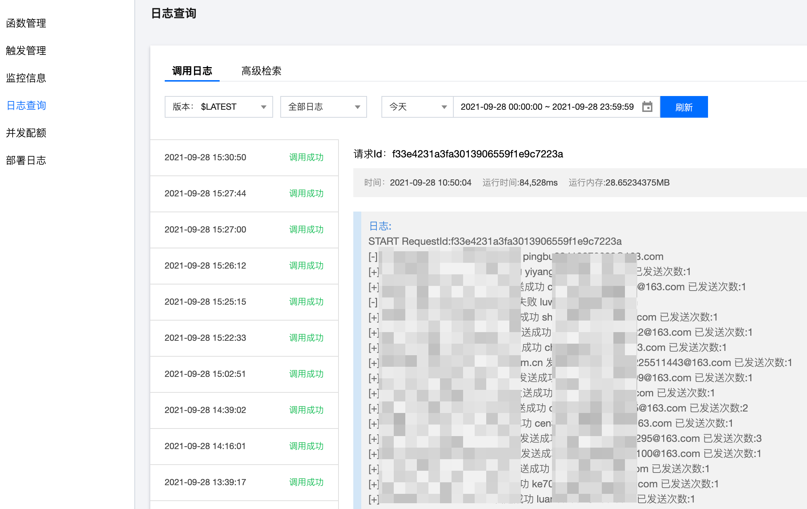

设置了阈值，邮箱池中的每个邮箱只能发送10封钓鱼邮件，根据需求可以在脚本里自行更改阀值。

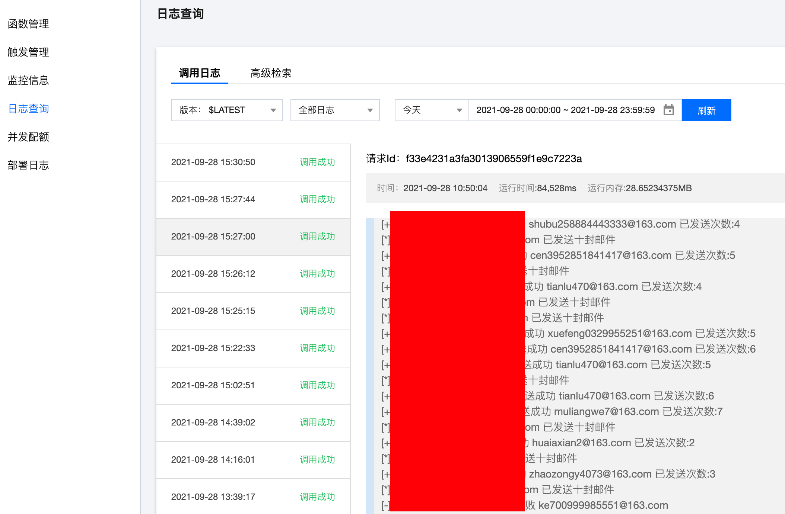

详细记录了每个邮箱发送的目标邮箱列表和未发送的目标邮箱列表

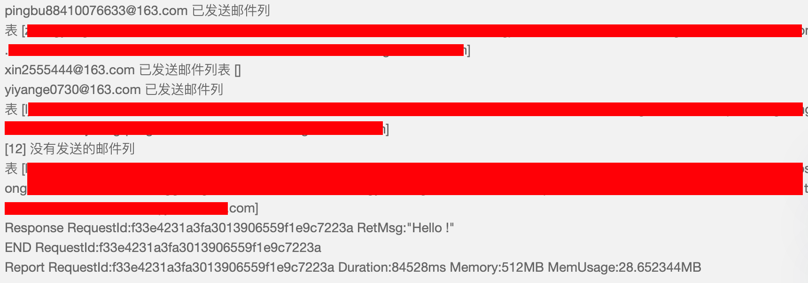


### 邮件内容效果展示

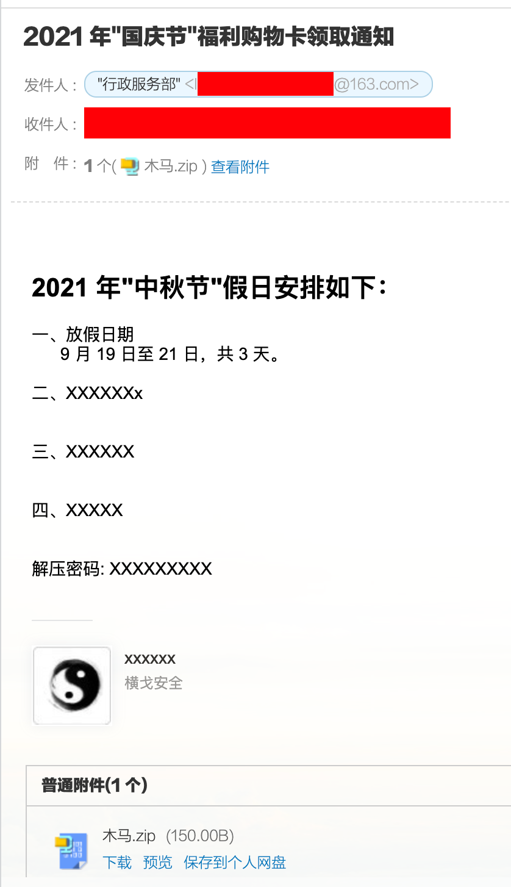


## 0x03 如何避免成为垃圾邮件

经过多次测试，如何有效的绕过各大厂商的邮件网关，这里总结几种方法

1. 正文不要添加超链接

2. 正文内容要长一点，太短的内容会被认为是垃圾邮件。

3. 附件里Zip压缩包双层加密，测试过某厂，会检测你附件压缩包里有没有exe后缀的文件

   假设木马是exe后缀的，先给木马压缩，这一步不需要加密。然后再次压缩，只不过这次要加密。这样因为最外层的加密了，它无法解压。然后压缩包里的文件还是压缩包，不是exe后缀的，它就不拦截了。

   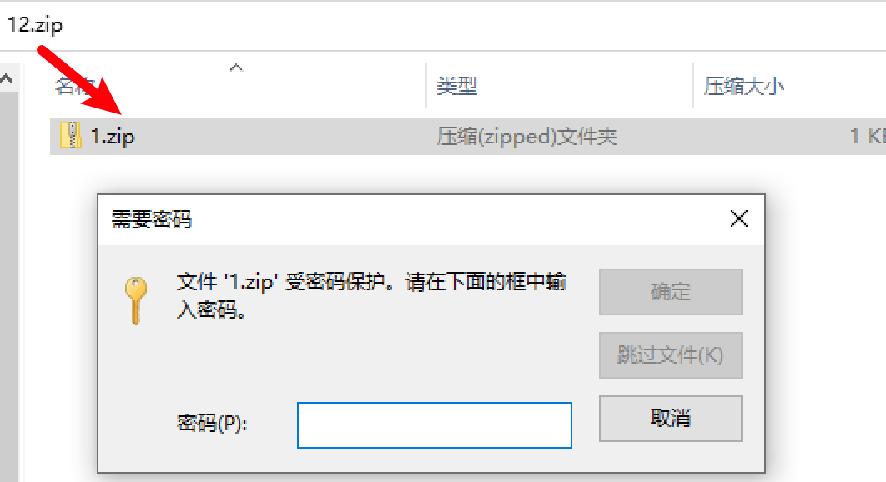

4. 7z压缩，对文件名加密，这样打开压缩包的时候也看不到文件名

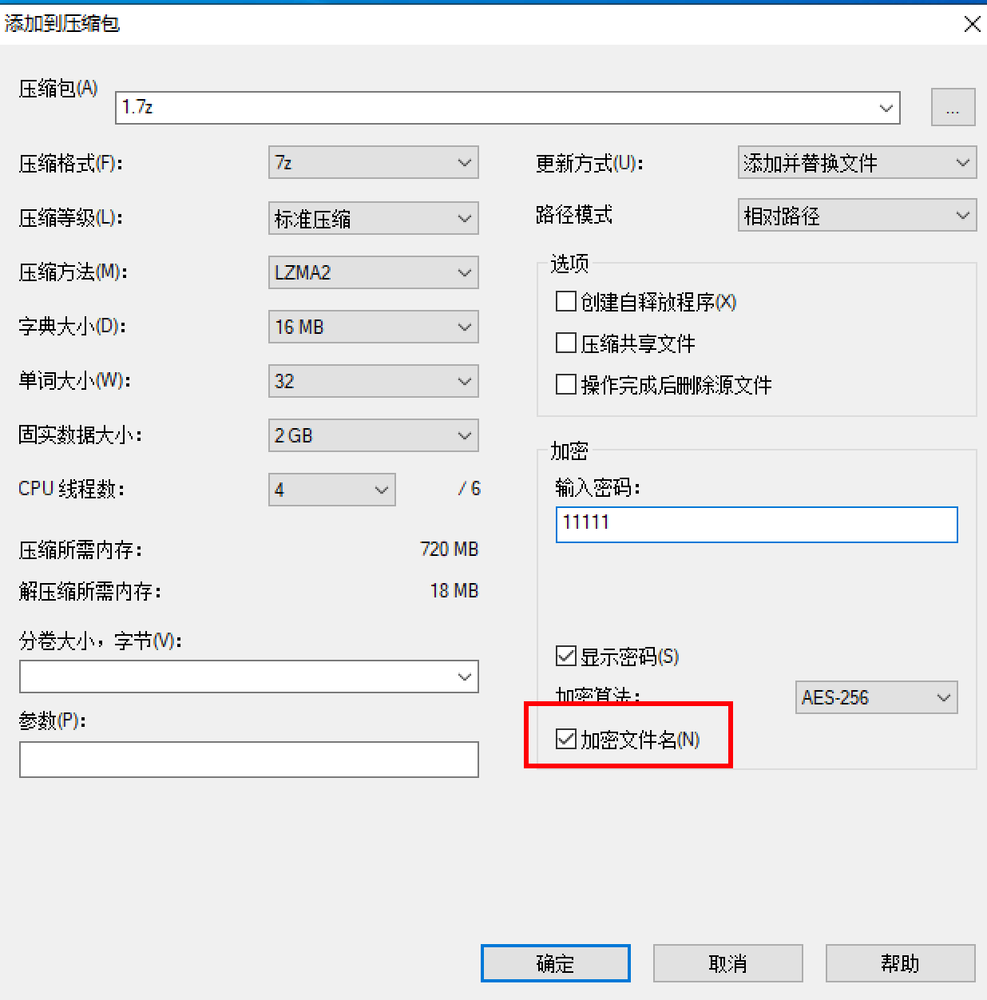

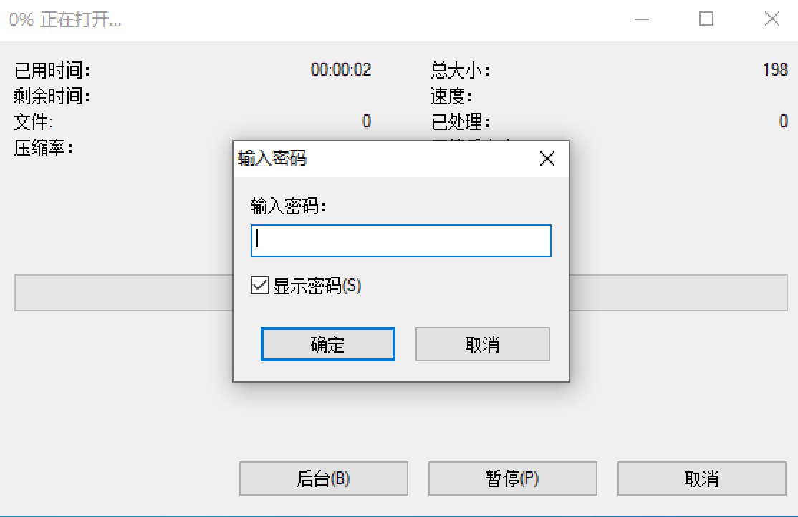

5. 目前的邮件内容编码都是base64，可以通过查看邮件原文可以看到。那么可以换个编码格式，例如使用Content-Transfer-Encoding: quoted-printable编码，效果如下

   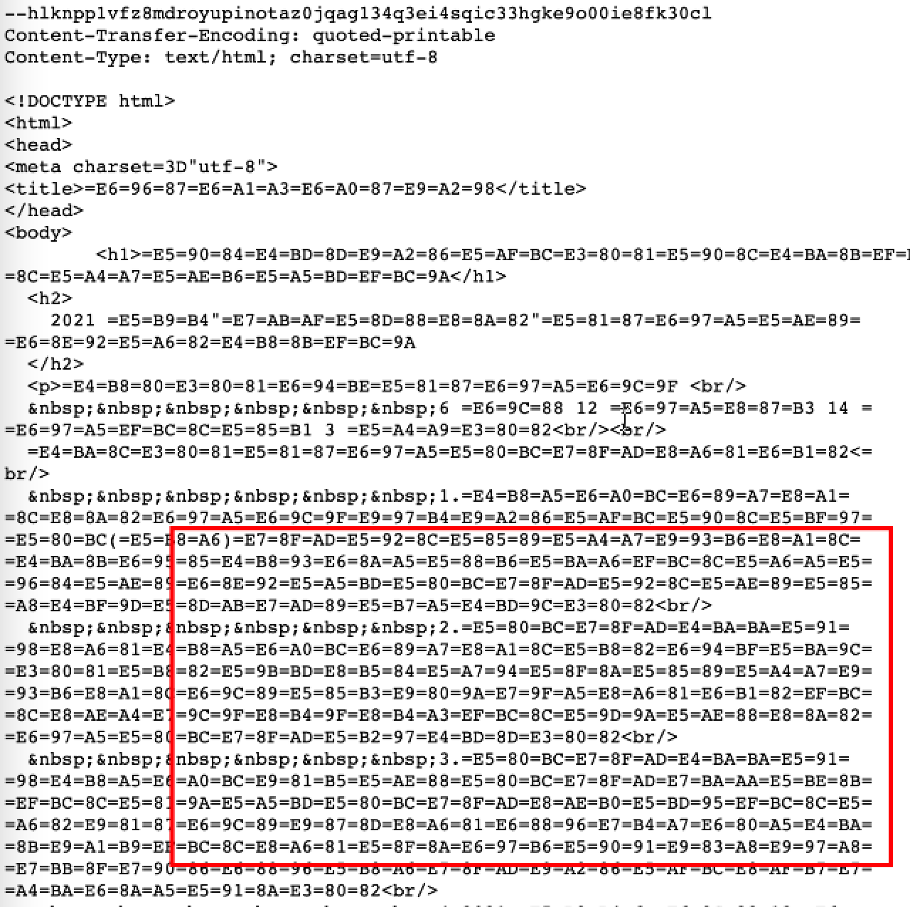


## 0x04 使用方法

### 0x04-1 代码解释

先看下项目的结构，main.go是主程序，go.mod是依赖，主要是看下面的四个文件。

`conf.ini、kami.txt、target.txt、1.zip`

**conf.ini是配置文件**

对应关系如下，根据自己的需求更改就行，主要是邮件正文。


邮件正文可以是html格式，也可以是纯文本。只需要将内容base64编码即可。

建议可以现在https://c.runoob.com/front-end/61/这个地址将你的话术整理好先


在http://tool.chinaz.com/tools/imgtobase/这里将图片base64编码


**kami.txt是邮箱池账号密码**

保存了邮箱池的账号密码，格式如下。


**target.txt是目标邮箱列表**


**1.zip是你木马的附件**：程序会从1.zip中读取内容，然后当作附件发送。


**打包程序**

运行下面两行命令得到了main.zip文件。后面在云函数中需要上传main.zip

```
GOOS=linux GOARCH=amd64 go build -o main main.go
zip main.zip main kami.txt 1.zip target.txt conf.ini
```


### 0x04-2 创建云函数

参考链接：https://blog.csdn.net/q2760259/article/details/116983027

新建一个云函数

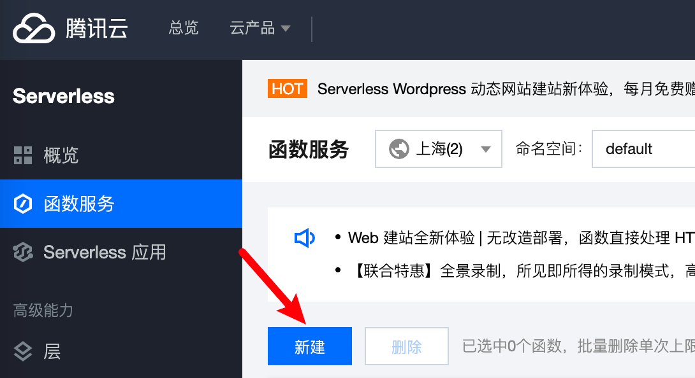

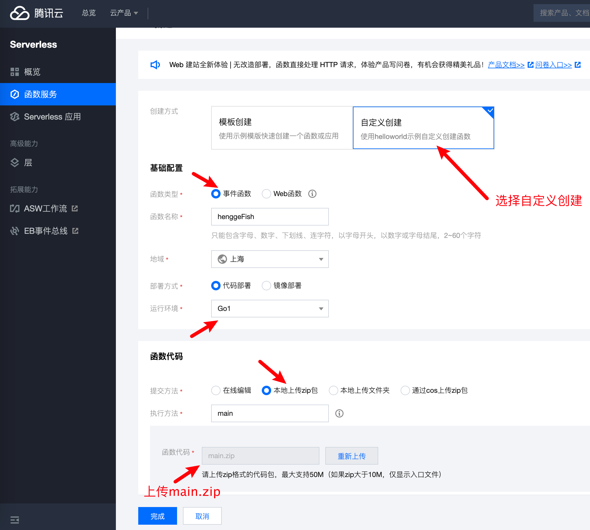

这里选择900秒，这样可以在日志中看到脚本运行的结果

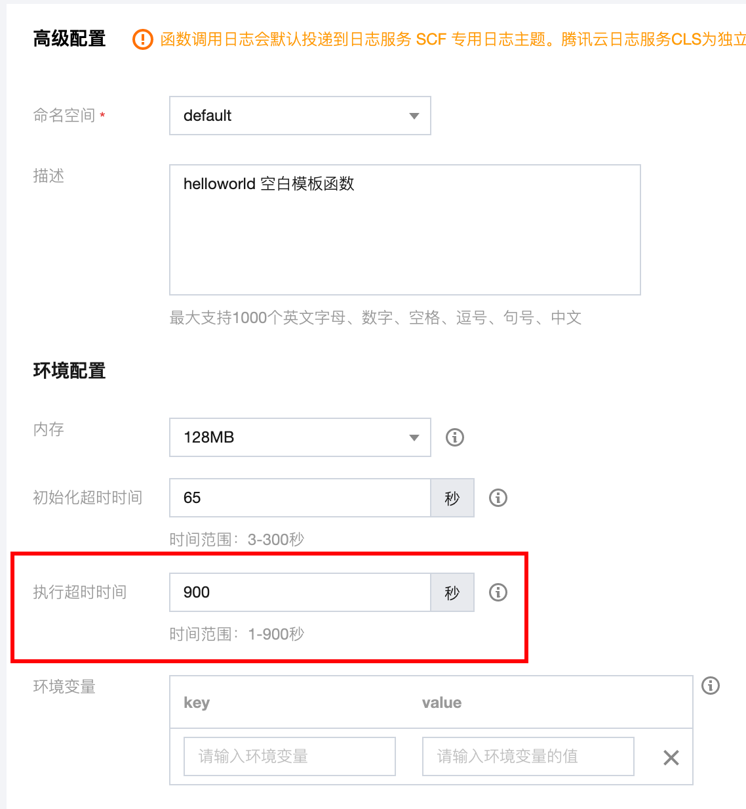

触发器的配置

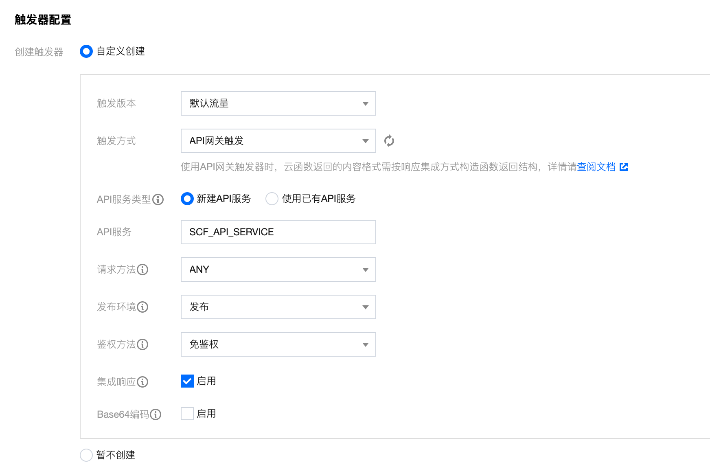

这样就创建成功了

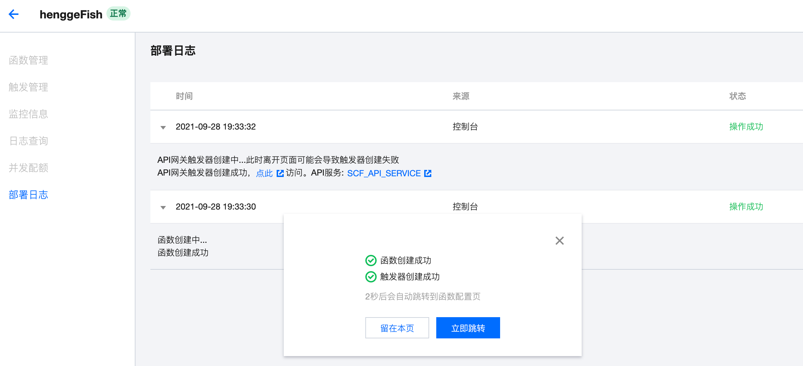

进入api服务


通过调试运行脚本


点击发送请求后，就运行脚本了

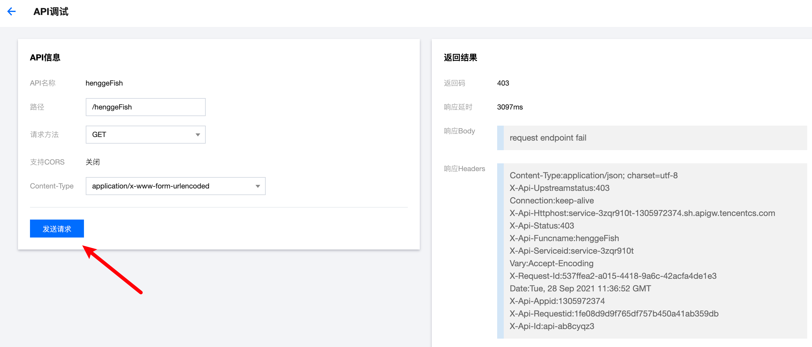


在日志查询中可以实时查看脚本运行的结果

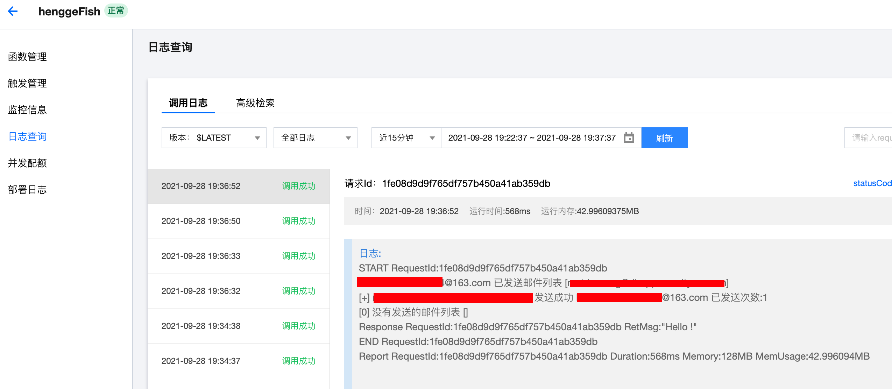


成功的收到了邮件


